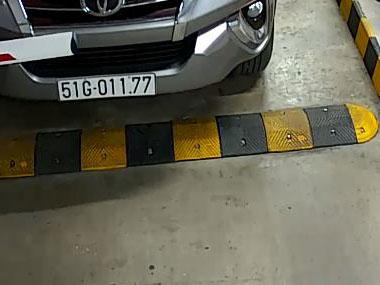
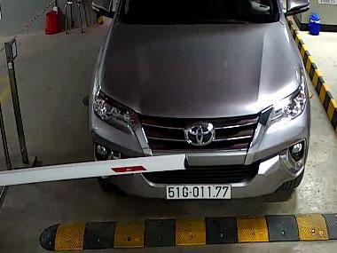
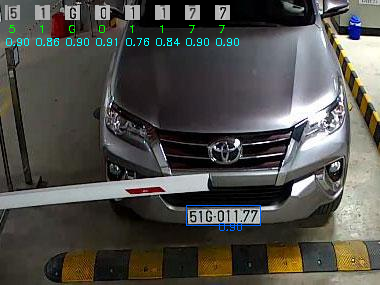

# License Plate Recognition

A deep learning system for automatic license plate detection and recognition.

---

## Overview

This project applies **Ultralytics YOLO** for license plate detection and a **PyTorch-based OCR model** for character recognition, supported by **OpenCV** and **NumPy**.

* **Performance**: Evaluated on 400 samples with 398 correct recognitions and only 2 errors.
* **Evaluation**: Extensive visualizations and detailed analysis are available in the results directory.

---

## Results

Example outputs (see more in [`results/`](./results)):

| Input                                  | Output                                 |
| -------------------------------------- | ----------------------------------------- |
|  |  |
|  |  |

---

## Usage

```bash
git clone https://github.com/marknguyen02/license-plate-recognition.git
cd license-plate-recognition
pip install -r requirements.txt
```

Run the demo notebook demo.ipynb

---

## Notes

* Current version is optimized for Vietnamese license plates, extensible to other formats.
* For access to the full dataset or detailed methodology, please contact me.

---

## Contact

* Gmail: [dungnguyen.workspace@gmail.com](mailto:dungnguyen.workspace@gmail.com)

## License

Released under the MIT License.


