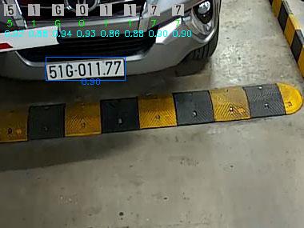
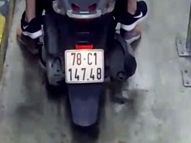
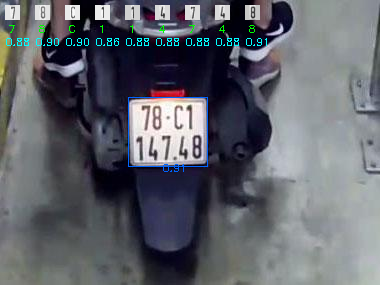

# License Plate Recognition

A deep learning system for automatic license plate detection and recognition.

---

## Overview

This project applies **Ultralytics YOLO** for license plate detection and a **PyTorch-based OCR model** for character recognition, supported by **OpenCV** and **NumPy**.

* **Performance**: Achieved **100% accuracy** on the test set of 400 samples, with all license plates correctly recognized.
* **Evaluation**: Extensive visualizations and detailed analysis are available in the data directory.

---

## Results

Comprehensive evaluation outputs are available in the [`data/outputs`](./data/outputs).  
Below are a few illustrative examples:

| Input Image | Model Output |
|-------------|--------------|
|  |  |
|  |  |

---


## Usage

```bash
git clone https://github.com/marknguyen02/license_plate_recognition.git
cd license_plate_recognition
pip install -r requirements.txt
```

Run the demo notebook demo.ipynb

---

## Notes

* Current version is optimized for **Vietnamese license plates**, extensible to other formats.
* For access to the full dataset or detailed methodology, please contact me.

---

## Contact

* Gmail: [dungnguyen.workspace@gmail.com](mailto:dungnguyen.workspace@gmail.com)

## License

Released under the MIT License.


